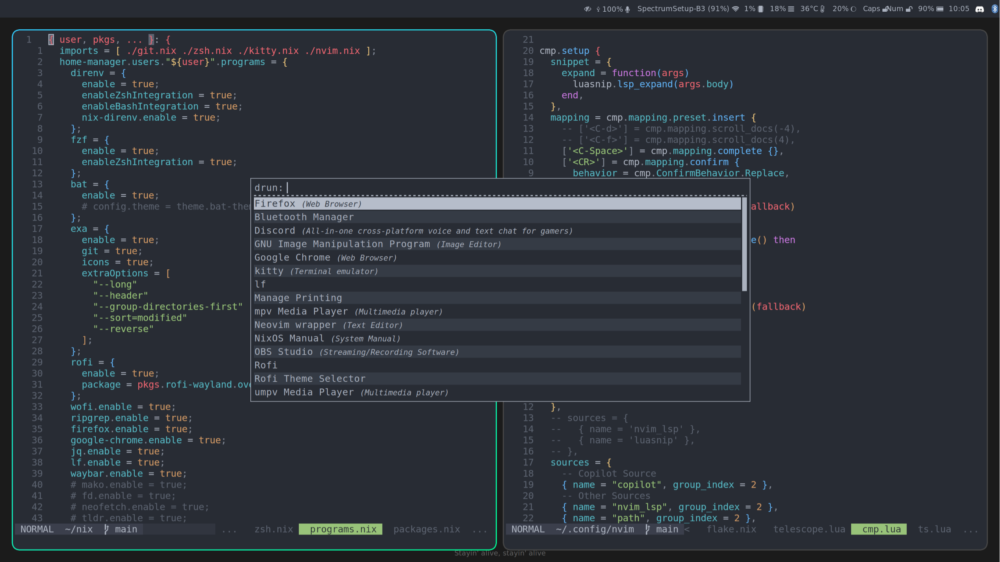

My personal NixOS config using flakes:  
```
git clone https://github.com/exformation/nix.git ~/nix \
    && cd ~/nix \
    && sudo nixos-rebuild switch --flake '.#exform'
```

- I use modules for home-manager, stylix, hyprland, and sometimes neovim.  
- Parts of the config are still messy, like all the overlap for packages/programs/services between nixos and hm, which I find annoying, but overall it's pretty nice.  
- TODO: more binds, better bar, etc. 




This config will not work on your machine as-is, but it may be useful as a reference.
